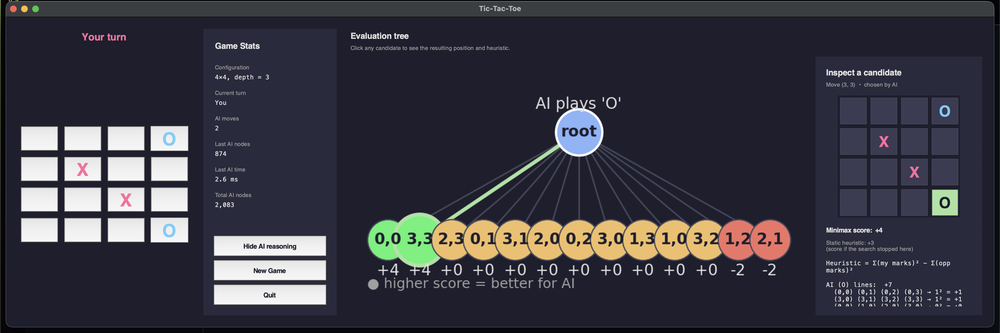
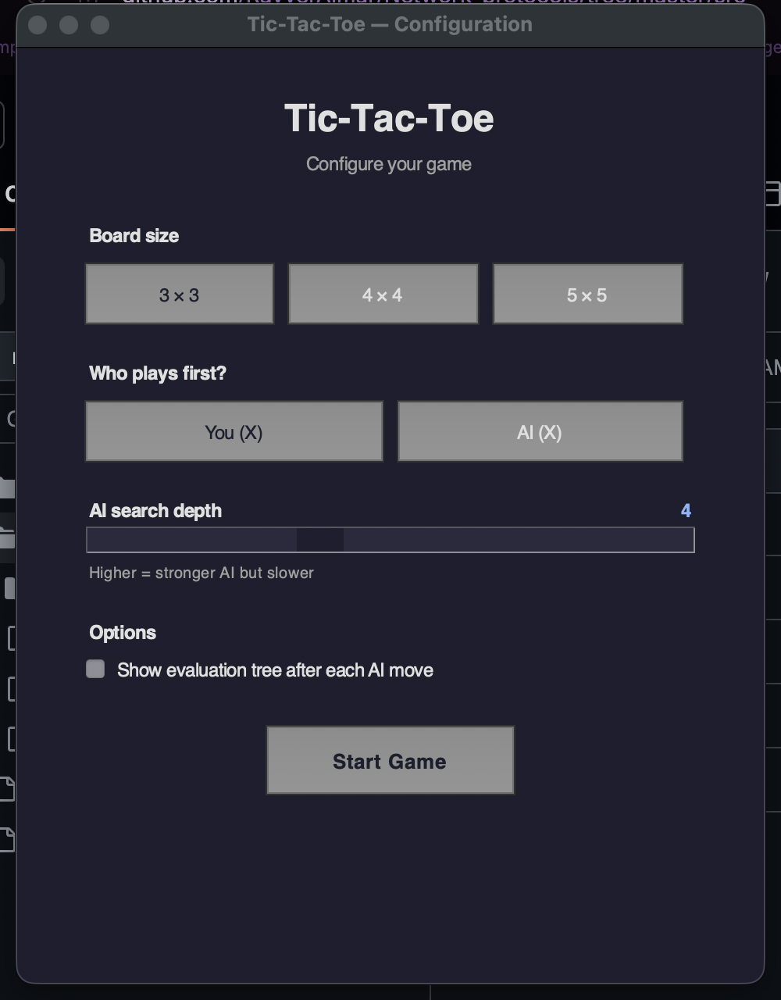
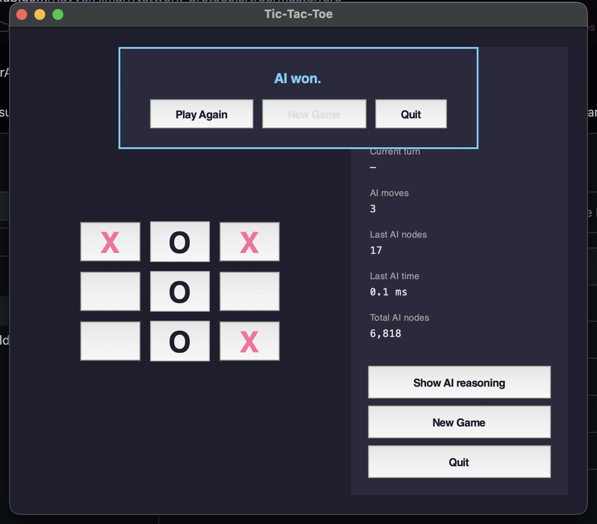
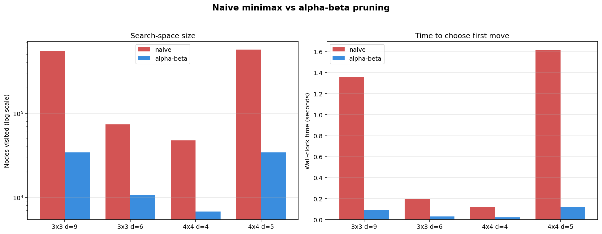

<div align="center">

# Adversarial Search — Tic-Tac-Toe with Minimax + Alpha-Beta

**Configurable N×N tic-tac-toe with a minimax AI. Polished single-window Tk GUI with a live evaluation-tree inspector, plus a headless CLI.**

[](https://www.python.org/downloads/)
[](#testing)
[](#how-the-search-works)

</div>

---

This repository implements the **minimax algorithm with alpha-beta pruning** for tic-tac-toe on arbitrary `N x N` boards.

## Highlights

- **Single-window GUI** — board, stats, evaluation tree, and candidate-inspection panel all live together. Toggle the tree on/off with one button or by clicking the AI's last move.
- **Click-to-inspect** — click any candidate node in the tree and the right panel shows the resulting position, the minimax score, and a line-by-line breakdown of the static heuristic.
- **Live stats** — nodes visited, decision time, and totals update after every AI move.
- **Game-over overlay** — Play Again (same config), New Game (back to config), or Quit, without ever closing the window.
- **Headless CLI** — same engine, no display required. Asks "play again?" between games.
- **Benchmark + tests** — 7–18× speedup over naive minimax, 9 passing pytest tests.

## Screenshots

### Single-window game with evaluation tree



The right pane is the **inspection panel**: click any candidate node in the chart and see the resulting board, the minimax score, and a transparent line-by-line breakdown of the heuristic. The "Hide AI reasoning" button collapses the tree back to a compact stats-only view; clicking the AI's last move on the board re-opens it.

### Configuration dialog



### Game over



## Performance — naive vs alpha-beta

Generated by `python src/benchmark.py`:



| Configuration | Naive nodes | Alpha-beta nodes | Speedup |
|---|---:|---:|---:|
| 3×3, depth 9 (perfect play)  | 549,945 | 34,202 | **~16×** |
| 3×3, depth 6                  | 73,449  | 10,581 | ~7×    |
| 4×4, depth 4                  | 47,296  | 6,764  | ~7×    |
| 4×4, depth 5                  | 571,456 | 34,274 | **~17×** |

The original implementation was even slower than "naive" because it `deepcopy`'d the board at every child and recomputed the winning lines on every property access. The current engine mutates the board in place and caches winning lines per board size.

## CLI demo

A complete 3×3 self-play (both sides at depth 9 → forced draw, the known optimal result):

```
$ python src/cli.py --self-play --size 3 --depth 9

   |   |
---+---+---
   |   |
---+---+---
   |   |

AI (X) → (1, 1)  [nodes=34,202  time=66.5 ms]
   |   |
---+---+---
   | X |
---+---+---
   |   |

AI (O) → (0, 0)  [nodes=8,465  time=16.2 ms]
 O |   |
---+---+---
   | X |
---+---+---
   |   |

AI (X) → (2, 2)  [nodes=1,792  time=3.6 ms]
 O |   |
---+---+---
   | X |
---+---+---
   |   | X

...

Tied game.

Play again? [y/N]:
```

Each AI turn reports the nodes visited and decision time — useful both as a sanity check and as a feel for how fast alpha-beta is.

## Quickstart

**Requirements:** Python **3.10+** with the standard `tkinter` module (only required for the GUI; the CLI works without it). On macOS, the Python from `python.org` and the system `/usr/bin/python3` both ship Tk; some `homebrew` builds (notably 3.14) do **not** — see [Troubleshooting](#troubleshooting).

```bash
git clone https://github.com/RayverAimar/Adversarial-search.git
cd Adversarial-search

python3 -m venv .venv
source .venv/bin/activate            # Windows: .venv\Scripts\activate
pip install -r requirements.txt
```

That's it. Now pick how you want to play:

### Play in the GUI

```bash
cd src
python main.py
```

You'll see the configuration dialog (board size 3/4/5, who moves first, AI depth slider, and a "Show evaluation tree after each AI move" checkbox). Click **Start Game** and play. The evaluation tree can be toggled at any time — there's a **Show / Hide AI reasoning** button in the stats panel, and clicking the AI's last move on the board does the same thing.

### Play in the terminal (no GUI required)

```bash
python src/cli.py                       # 3x3, perfect AI, you go first
python src/cli.py --size 4 --depth 4    # 4x4 board, depth-limited AI
python src/cli.py --ai-first            # AI moves first
python src/cli.py --self-play           # AI vs AI
python src/cli.py --no-replay           # don't ask "play again?" at the end
python src/cli.py --help                # full CLI flags
```

You'll be prompted with `Your move (X) as 'row col'` — answer with two integers, e.g. `1 1` for the center. After each game the CLI asks `Play again? [y/N]`.

### Run the tests

```bash
pytest tests/ -v
```

### Regenerate the benchmark chart

```bash
python src/benchmark.py    # writes benchmark.png in the current directory
```

## Troubleshooting

**`ModuleNotFoundError: No module named '_tkinter'`** when running the GUI.
Your Python build was compiled without Tk. The CLI still works; for the GUI, pick one of:

```bash
# macOS — use a Python that bundles Tk
brew install python-tk@3.12
/usr/local/bin/python3.12 -m venv .venv     # recreate the venv with this interpreter

# Debian / Ubuntu
sudo apt-get install python3-tk
```

Then redo `source .venv/bin/activate && pip install -r requirements.txt`.

## How the search works

The AI evaluates positions with **minimax**: it assumes both players play optimally and picks the move maximizing its worst-case outcome. **Alpha-beta pruning** discards branches that cannot influence the final decision, dramatically shrinking the search tree without changing the result.

```
search(board, depth, α, β, maximizing):
    if winner: return ±(INF − depth)        # prefer faster wins / slower losses
    if depth == max or full: return heuristic(board)
    for each empty cell:
        play move, recurse, undo move
        update α (or β); cut off if α ≥ β
```

### The heuristic

The leaf scoring function is **quadratic open-line counting**:

```
score = Σ (my_marks_on_line)²  −  Σ (opp_marks_on_line)²
```

A line counts only if it's still winnable (i.e., no opposing mark on it). The squaring is what makes the engine actually advance toward completing a line: a line with two of my marks scores **+4**, vs. **+1** for a single mark. With a flat (linear) score, the AI has no reason to stack marks on a single line.

### The evaluation tree viewer

After each AI move, the embedded chart shows root → every legal candidate move with its minimax score, the chosen move outlined in green. **Why only one level deep?** A 3×3 root has 9 children; depth 2 alone is up to 72 nodes; the full tree is unreadable. The top-level candidates with their final minimax scores answer the user's actual question — *"what did the AI think of every move it could make?"* — and the click-to-inspect panel lets the user dig into any individual position to see the heuristic the search bottoms out on.

## Project structure

```
Adversarial-search/
├── src/
│   ├── main.py                     # GUI entry point — config ↔ game loop
│   ├── cli.py                      # Headless CLI (play, self-play, replay)
│   ├── benchmark.py                # Generates benchmark.png
│   └── include/
│       ├── theme.py                # Shared colors / fonts / window centering
│       ├── config_dialog.py        # Single-window configuration dialog
│       ├── tic_tac_toe.py          # Game window: board + stats + embedded tree
│       ├── tic_tac_toe_handler.py  # Game state / win detection
│       ├── tree_viewer.py          # Embedded tree chart + inspection panel
│       ├── minimax_tree.py         # Engine: alpha-beta search + heuristic
│       └── utils.py                # Move / Player namedtuples
├── tests/
│   └── test_minimax.py             # 9 tests for the search engine
├── scripts/
│   └── take_screenshots.py         # Regenerates the GUI screenshots
├── benchmark.png
├── gui_config.png
├── gui_game.png
├── gui_gameover.png
└── requirements.txt
```

## Testing

The suite covers:

- Terminal detection (rows / columns / diagonals).
- The AI never loses 3×3 from the empty board against itself (forced draw).
- Forced-win recognition (takes the winning move when it exists).
- Threat blocking (blocks the opponent's immediate threat).
- Alpha-beta visits strictly fewer nodes than the unpruned engine.
- Faster-win preference via the `INF − depth` terminal score.

## Possible next steps

- **Iterative deepening** — search progressively deeper within a time budget.
- **Transposition table** — cache evaluated positions (Zobrist hashing).
- **Smarter move ordering** — try center / corners first to maximize α-β cutoffs.
- **NegaMax refactor** — collapse the maximizing / minimizing branches.
- **Difficulty presets** — Easy / Medium / Hard / Perfect mapped to depths.
- For arbitrary games (Connect-4, Gomoku, Othello), pair this engine with a domain-specific heuristic.

## Contributors

- Chillitupa Quispihuanca, Alfred Addison
- Muñoz Curi, Rayver Aimar

<a href="https://github.com/RayverAimar/Adversarial-search/graphs/contributors">
  
</a>
