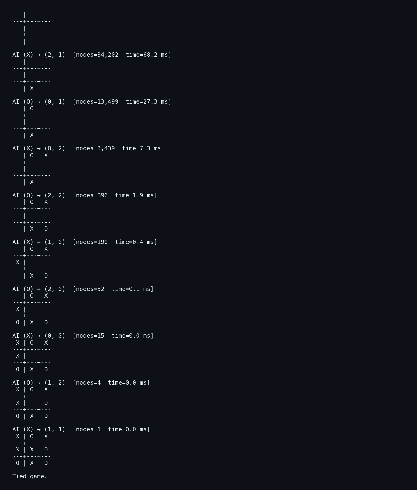

<div align="center">

# Adversarial Search — Tic-Tac-Toe with Minimax + Alpha-Beta

**Configurable N×N tic-tac-toe with a minimax AI you can play against in a Tk GUI or directly from the terminal.**

[](https://www.python.org/downloads/)
[](#testing)
[](#how-the-search-works)

</div>

---

This repository implements the **minimax algorithm with alpha-beta pruning** to play tic-tac-toe on arbitrary `N x N` boards. You can play against the AI through a Tkinter GUI or through a headless command-line interface, and there's a benchmark that quantifies how much alpha-beta speeds the search up.

## Performance — naive vs alpha-beta

Generated by `python src/benchmark.py`:


| Configuration | Naive nodes | Alpha-beta nodes | Speedup |
|---|---:|---:|---:|
| 3×3, depth 9 (perfect play)  | 549,945 | 34,202 | **~16×** |
| 3×3, depth 6                  | 73,449  | 9,159  | ~8×    |
| 4×4, depth 4                  | 47,296  | 6,767  | ~7×    |
| 4×4, depth 5                  | 571,456 | 31,844 | **~18×** |

The original implementation was even slower than "naive" because it `deepcopy`'d the board at every child and recomputed the winning lines on every property access. The current engine mutates the board in place and caches winning lines per board size.

## CLI demo

A complete 3×3 self-play (both sides at depth 9 → forced draw, the known optimal result):



## Quickstart

```bash
git clone https://github.com/RayverAimar/Adversarial-search.git
cd Adversarial-search

python3 -m venv .venv
source .venv/bin/activate
pip install -r requirements.txt
```

### Play in the terminal (no GUI required)

```bash
python src/cli.py                    # 3x3, perfect AI, you go first
python src/cli.py --size 4 --depth 4 # 4x4 board, depth-limited AI
python src/cli.py --ai-first         # AI moves first
python src/cli.py --self-play        # AI vs AI
```

You'll be prompted with `Your move (X) as 'row col'` — answer with two integers, e.g. `1 1` for the center.

### Play in the Tkinter GUI

```bash
cd src
python main.py
```

You'll be asked for search depth, who moves first, and the board size, then dropped into the game window.

## How the search works

The AI evaluates positions with **minimax**: it assumes both players play optimally and picks the move maximizing its worst-case outcome. **Alpha-beta pruning** discards branches that cannot influence the final decision, dramatically shrinking the search tree without changing the result.

```
search(board, depth, α, β, maximizing):
    if winner: return ±(INF − depth)        # prefer faster wins / slower losses
    if depth == max or full: return heuristic(board)
    for each empty cell:
        play move, recurse, undo move
        update α (or β); cut off if α ≥ β
```

The leaf heuristic counts open lines still winnable by the AI minus open lines still winnable by the opponent — fast and good enough for tic-tac-toe.

## Project structure

```
Adversarial-search/
├── src/
│   ├── main.py                 # Tk GUI entry point
│   ├── cli.py                  # Headless CLI (play, self-play)
│   ├── benchmark.py            # Generates benchmark.png
│   └── include/
│       ├── minimax_tree.py     # Minimax engine with alpha-beta
│       ├── tic_tac_toe.py      # Tk game window
│       ├── tic_tac_toe_handler.py
│       ├── depth_getter.py
│       ├── dimension_getter.py
│       ├── first_move_getter.py
│       └── utils.py
├── tests/
│   └── test_minimax.py         # 9 tests for the search engine
├── scripts/
│   └── render_cli_demo.py      # Generates cli_demo.png
├── benchmark.png
├── cli_demo.png
└── requirements.txt
```

## Testing

```bash
pytest tests/ -v
```

The suite covers:

- Terminal detection (rows / columns / diagonals).
- The AI never loses 3×3 from the empty board against itself (forced draw).
- Forced-win recognition (takes the winning move when it exists).
- Threat blocking (blocks the opponent's immediate threat).
- Alpha-beta visits strictly fewer nodes than the unpruned engine.
- Faster-win preference via the `INF − depth` terminal score.

## What was fixed in this revision

- **Replaced exponential `deepcopy` board copies** with in-place move/undo — the search now mutates a single board.
- **Added alpha-beta pruning** — ~7–18× fewer nodes visited (see benchmark).
- **Cached winning lines** per board size with `lru_cache`.
- **Removed the module-level `avatars = []` global** — engines are now properly self-contained instances.
- **Fixed a Tk widget leak** in `tic_tac_toe.py`: every AI move was creating an unused `tk.Frame`.
- **Fixed `is_winner`** which used to return `None` instead of `False` on the no-winner branch.
- Added a headless CLI, a benchmark, tests, and `requirements.txt`.

## Possible next steps

- **Iterative deepening** — search progressively deeper within a time budget.
- **Transposition table** — cache evaluated positions (Zobrist hashing).
- **Smarter move ordering** — try center / corners first to maximize α-β cutoffs.
- **NegaMax refactor** — collapse the maximizing / minimizing branches.
- For arbitrary games (Connect-4, Gomoku, Othello), pair this engine with a domain-specific heuristic.

## Contributors

- Chillitupa Quispihuanca, Alfred Addison
- Muñoz Curi, Rayver Aimar

<a href="https://github.com/RayverAimar/Adversarial-search/graphs/contributors">
  
</a>
